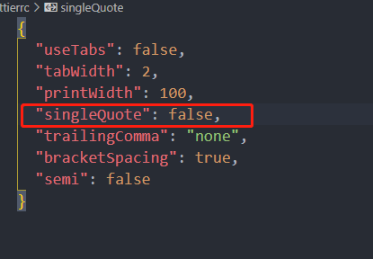

### 使用 vite 搭建 vue3+ts+antV 开发环境

---

#### 使用 vite 创建项目

##### 1.我们可以通过以下几种方式去创建 vite 的项目

使用 npm

> npm: npm init vite@latest

使用 yarn

> yarn: yarn create vite

使用 pnpm

> pnpm create vite

##### 2.创建项目时需要我们选择使用的框架等信息，按照下面这样选就行。

---

#### 导入 Antd-vue

##### 1.安装 Antd-vue

> npm i --save ant-design-vue@next

##### 2.实现按需加载,Vite 需要使用 [unplugin-vue-components](https://github.com/antfu/unplugin-vue-components)

> npm i unplugin-vue-components -D

##### 3.安装完 unplugin-vue-components 后修改 vite.config.ts 文件

这样我们就能够直接在组件中使用 Antd-vue 的组件而不需要引入了

#####

---

#### 加入 Eslint 检查

为了规范代码格式，减少编写错误，需要加入 Eslint 检查

##### 1.首先我们需要安装 Eslint

> npm install eslint -D
>
> npx eslint --init

##### 2.按照如下选择，最后选择 Yes 安装配置就好

##### 3 安装成功就会本地目录里面就会生成一个.eslintrc.js 的文件，我们需要对文件进行一下修改

修改为 vue3 的校验规则

---

#### Prettier 格式化代码

添加完 Eslint 之后就是添加代码的格式化，就是使用 Prettier 来格式化代码了。

##### 1.Vscode 安装 Prettier 插件

##### 2. 在项目根目录创建.prettierrc 文件

##### 3.修改 Vscode 配置，设置保存自动格式化

设置完成后，当我们修改文件保存时就可以自动格式化代码了。

##### 4. 解决 Eslint 和 Prettier 的冲突问题

Eslint 和 Prettier 的配合使用会有一定的冲突问题存在，例如我把 Prettier 的格式化规则的单引号改为双引号，那么 Eslint 就会报错，

为了解决这个问题，我们就需要用到 **eslint-config-prettier** 这个**Eslint**插件，这个插件的作用就是禁用所有格式相关的规则，把这部分交给**Prettier**去处理

##### 1. 首先我们先安装这个插件

> npm install --save-dev eslint-config-prettier

##### 2.安装完成之后修改**.eslintrc.js** 文件

修改完这个文件之后，我们可以看到这个冲突就消失了，证明我们就配置好了。

---

#### 配置路径别名

##### 1.**Vite**中配置路径别名，需要修改 **vite.config.ts**文件,配置好后就可以使用

##### 2.修改 eslint 和 ts 配置，使得他们识别路径

我们配置好了路径别名，可是 eslint 和 ts 并不知道这个路径别名，那么当我们去写路径的时候就会发现，导入路径明明是对的，eslint 会报错或者写路径的时候完全没有提示，这就造成了很不好的开发体验，那么我们下面就去配置一下解决这些问题

##### 问题一

当我们配置好路径别名后，使用路径别名去引入组件时，eslint 可能会提示找不到组件(如下图)，实际路径是对的,这个就是 eslint 不认识这个路径别名所造成的。（现在新版本好像又没有问题了，大家可以先试试，如果没有提示错误可以不配置）

##### 1.为了解决这个问题，就需要安装 **eslint-import-resolver-alias**这个插件

> npm i eslint-import-resolver-alias -D

##### 2. 配置**.eslintrc.js**文件

完成这两步之后，eslint 就不会提示找不到组件了

##### 问题二 使用路径别名引入没有文件路径提示

##### 1. 修改 tsconfig.json

解决这个问题只需要修改 **tsconfig.json**就好

#### 总结

那么一个基本的 Vite 项目配置就搭建好了，后续我有空会加上 git 提交时候的 提交格式规范和代码自动格式化等。
